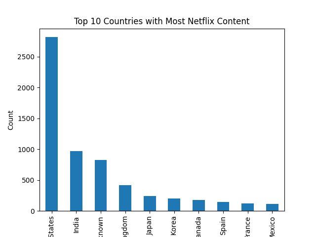
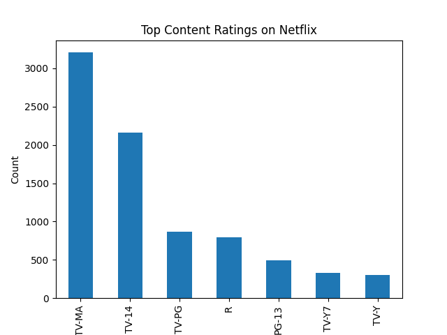
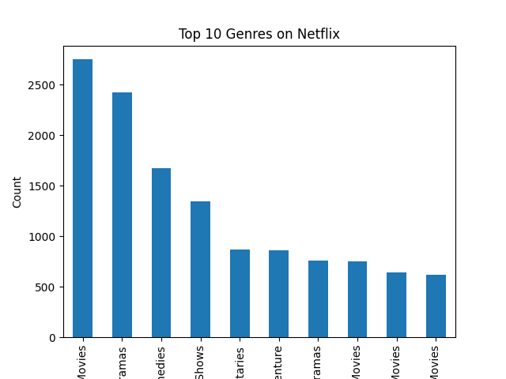

# netflix-data-analysis
This project performs Exploratory Data Analysis (EDA) on the Netflix dataset using Python. The analysis focuses on understanding content distribution, trends over time, ratings, countries, and popular genres available on Netflix.

## 📊 Visualizations

### Content Type Distribution

### Ratings Distribution

### Content Added Over Years

### Country-wise Content

### Genre Distribution

